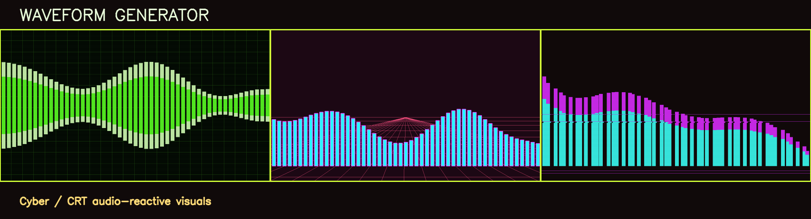
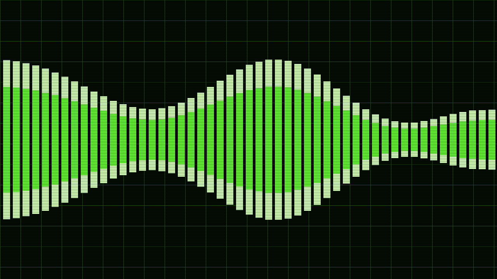
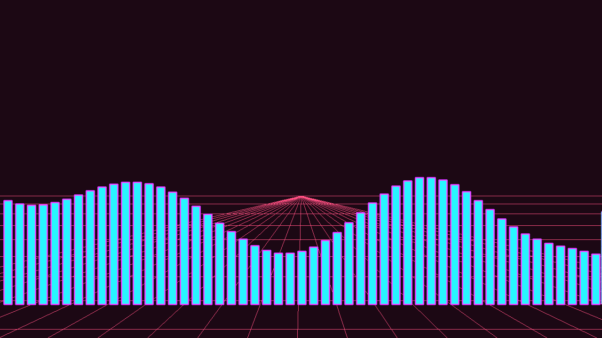
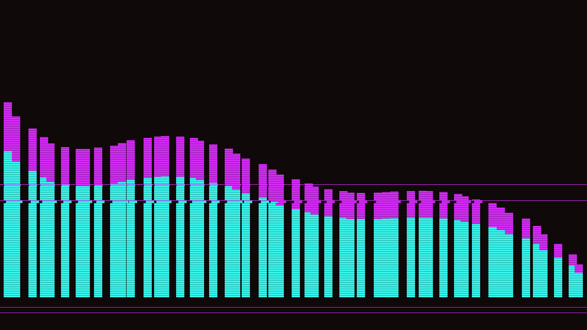

<p align="center">
  
</p>

<h1 align="center">Waveform Generator</h1>

<p align="center">
  Turn music into Cyber/CRT energy-bar videos from a desktop GUI or scriptable CLI.
</p>

<p align="center">
  <a href="#gui-usage">GUI</a> ·
  <a href="#cli-usage">CLI</a> ·
  <a href="#preview-gallery">Preview Gallery</a> ·
  <a href="#development">Development</a>
</p>

Waveform Generator is a small Python tool for creating MP4 audio visualizers. It is built for creators who want fast, audio-reactive visuals without opening a full video editor, and for developers who want a hackable rendering script they can automate.

## Highlights

- GUI mode for quick creative work.
- CLI mode for repeatable batch rendering.
- 11 visual presets, including new Cyber/CRT styles.
- MP4 output with the original audio track merged in.
- Custom background, bar, and highlight colors.
- Adjustable FPS, bar count, video size, and audio sensitivity.
- No new runtime dependency beyond the existing Python stack and FFmpeg.

## Preview Gallery

The images below are generated by the current renderer, using synthetic audio energy data and the built-in Cyber/CRT presets.

| CRT Oscilloscope | Cyber Grid | Signal Glitch |
| --- | --- | --- |
|  |  |  |
| Green signal bars, dark grid, CRT scanlines. | Neon bars over a perspective grid. | Jittered bars, scanlines, short signal breaks. |

## Full Preset List

| Preset | Visual Style |
| --- | --- |
| Classic Rectangles | Fast traditional vertical bars |
| Modern Rounded | Soft rounded bars |
| Tech Dots | Stacked circular dots |
| Rock Peaks | Sharp triangular peaks |
| Symmetric Bars | Bars expand from the center line |
| Waterfall Gradient | Layered vertical gradients |
| Pulse Breathing | Periodic breathing motion |
| Neon Glow | Bright layered neon outlines |
| CRT Oscilloscope | CRT grid and scanline signal bars |
| Cyber Grid | Neon perspective-grid visualizer |
| Signal Glitch | Jittered signal-break visualizer |

## Requirements

- Python 3.10-3.12 recommended
- FFmpeg installed and available in your system `PATH`
- macOS, Windows, or Linux

Install FFmpeg:

```bash
# macOS
brew install ffmpeg

# Ubuntu / Debian
sudo apt update
sudo apt install ffmpeg
```

On Windows, download FFmpeg from [ffmpeg.org](https://ffmpeg.org/download.html), extract it, add the `bin` folder to `PATH`, then verify with:

```bash
ffmpeg -version
```

## Installation

```bash
git clone https://github.com/glassesmonkey/waveform_generator.git
cd waveform_generator
python3 -m venv venv
source venv/bin/activate
pip install -r requirements.txt
```

On Windows:

```bash
venv\Scripts\activate
```

Python 3.13 is not recommended yet because the audio stack may try to compile `numba` and `llvmlite` from source on some systems.

## GUI Usage

```bash
python generator.py
```

1. Select a folder that contains audio files.
2. Pick a visual preset.
3. Adjust colors and render settings if needed.
4. Click **Generate Energy Bar Videos**.
5. Find the MP4 files in `energy_bar_videos_output`.

Supported audio formats: `.wav`, `.mp3`, `.flac`, `.aac`, `.m4a`, `.ogg`.

## CLI Usage

Render a folder with the default style:

```bash
python generator.py --input ./audio
```

Render with a Cyber/CRT preset:

```bash
python generator.py --input ./audio --style "CRT Oscilloscope"
```

Render a 1080p Cyber Grid batch:

```bash
python generator.py \
  --input ./audio \
  --style "Cyber Grid" \
  --fps 30 \
  --bars 96 \
  --width 1920 \
  --height 1080 \
  --sensitivity 1.8
```

Write to a custom output folder:

```bash
python generator.py --input ./audio --output ./renders --style "Signal Glitch"
```

CLI options:

| Option | Default | Notes |
| --- | --- | --- |
| `--input` | required in CLI mode | Folder containing audio files |
| `--style` | `Classic Rectangles` | Must match one of the preset names |
| `--output` | `energy_bar_videos_output` | Created automatically |
| `--fps` | `25` | Valid range: 1-60 |
| `--bars` | `64` | Valid range: 8-256 |
| `--width` | `1280` | Valid range: 320-3840 |
| `--height` | `720` | Valid range: 240-2160 |
| `--sensitivity` | `1.5` | Valid range: 0.5-3.0 |

## Recommended Settings

| Goal | FPS | Bars | Size |
| --- | ---: | ---: | --- |
| Fast preview | 20 | 32 | 1280x720 |
| Balanced render | 25 | 64 | 1280x720 |
| High-detail render | 30 | 128 | 1920x1080 |

Sensitivity controls how strongly quiet passages move the bars. Lower it when quiet sections look too active; raise it when quiet recordings barely move.

## Output

Generated videos are named like this:

```text
original-audio-name_style-name_energy_bars.mp4
```

Example:

```text
demo_crt_oscilloscope_energy_bars.mp4
```

## Troubleshooting

### FFmpeg is missing

Run `ffmpeg -version` in a terminal. If the command fails, install FFmpeg or fix your `PATH`.

### Processing is slow

Use `1280x720`, lower FPS to `20` or `25`, reduce bars to `32` or `64`, or use `Classic Rectangles` for the fastest renderer.

### The bars barely move

Increase sensitivity, try a track with stronger dynamics, or use a higher-contrast color palette.

### CLI exits with an error

Check that the input folder exists, contains supported audio files, uses a valid style name, and has valid render settings.

## Development

The project intentionally keeps the implementation in one Python file so new contributors can follow the full rendering path:

1. Load audio with Librosa.
2. Convert it into Mel-frequency energy bands.
3. Render frames with OpenCV.
4. Merge video and audio with FFmpeg.
5. Save the final MP4.

Useful checks:

```bash
python3 -m py_compile generator.py
python3 generator.py --help
```

## Contributing

Issues and pull requests are welcome. Good next contributions include preview media, packaged desktop builds, more visual presets, performance profiling, and UI translations.

## License

MIT License.
